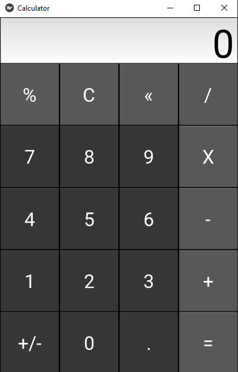

# Kivy Calculator
 A basic application to practice the usage of Kivy framework, created a basic working calculator that can perform all basic calculator operations
 
 Used this oppertunity to teach myself both Python as well as new GUI frameworks to open up possibilities for future projects
 
 
 Non scientific calculator that can handle all basic operations 
  1. Addition
  2. Subtraction
  3. Multiplication
  4. Divison

